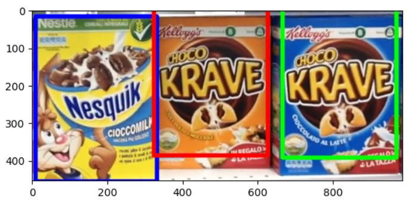

# Product Recognition on Store Shelves
This is a project made for the Computer Vision and Image Processing exam at Università di Bologna.
For the task of this project, read [this pdf](product-recognition-on-store-shelves.pdf).

## Step A
For the implementation of a solution to Step A of the task, open [Step A](<Step A Giri Matteo.ipynb>).

## Step B
For the implementation of a solution to Step B of the task, open [Step B](<Step B Giri Matteo.ipynb>).
## Step C
For the implementation of a solution to Step C of the task, open [Step C](<Step C Giri Matteo.ipynb>).
